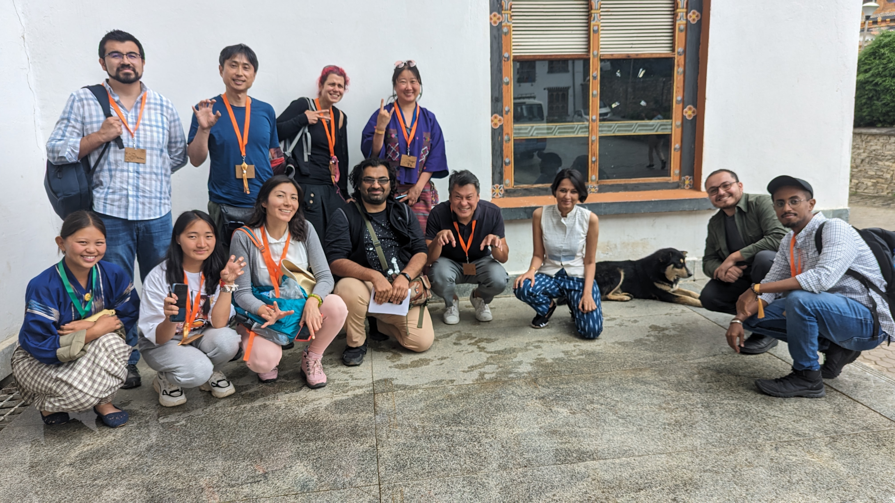

# About Us

Welcome to Make for Animals, where compassion meets innovation!

At Make for Animals, we are a passionate group of individuals who came together through the Fab ecosystem, driven by a common purpose - to make a meaningful difference in the lives of disabled or injured animals. Our mission is simple yet profound: to create accessible, cost-effective, and easily fabricable aids for our furry friends in need.

## Our Journey

Our journey began with a shared belief that technology and empathy can combine to improve the quality of life for animals facing mobility challenges. It all started within the Fab ecosystem, where like-minded individuals converged with a vision to design solutions that are not only functional but also affordable and easy to produce.

## Our Focus

Currently, our primary focus is on addressing the needs of injured and amputee dogs. We believe that by starting here, we can refine our approach, learn, and grow, with the ultimate goal of expanding our efforts to assist other animals in need.

## Our Approach

Our approach is grounded in simplicity, frugality, and accessibility. We're committed to designing aids that can be readily fabricated, making them available to animals and their caregivers worldwide. We understand the importance of making a positive impact in a cost-effective manner, and this principle guides every step of our journey.

## Join Our Cause

We invite you to join us in this incredible journey of compassion, creativity, and innovation. Whether you're a designer, engineer, animal lover, or someone simply interested in making a difference, there's a place for you in our community. Together, we can create a world where disabled and injured animals have the support they need to thrive.

## Get in Touch

Have an idea, a question, or simply want to connect with our team? Don't hesitate to reach out! Your support, insights, and collaboration are invaluable to us. Let's work together to make the world a better place for animals, one innovative solution at a time.

Please drop a mail: makeforanimals@gmail.com

Thank you for being a part of Make for Animals.

