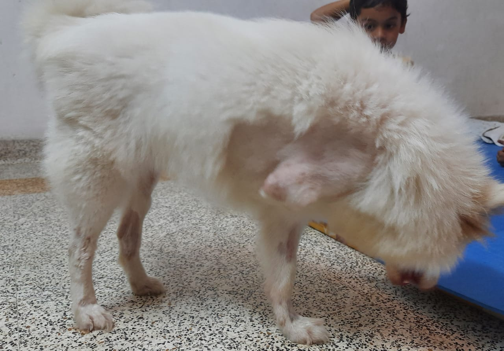
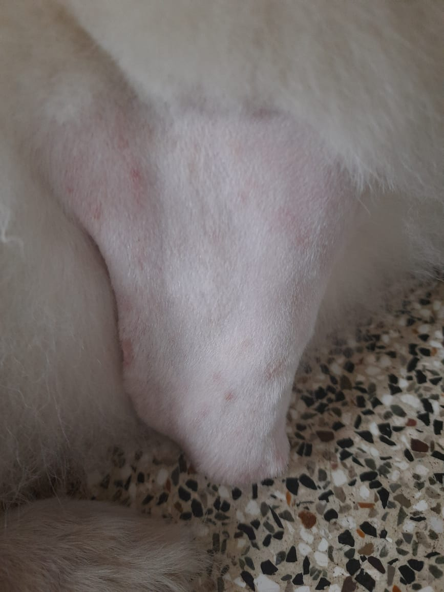
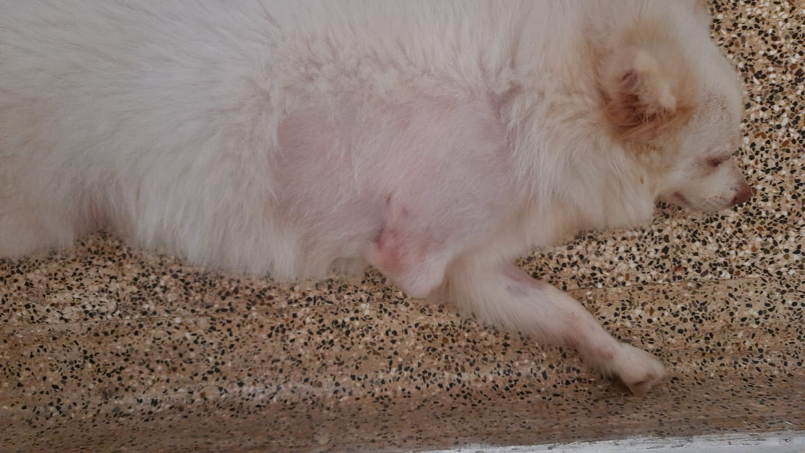
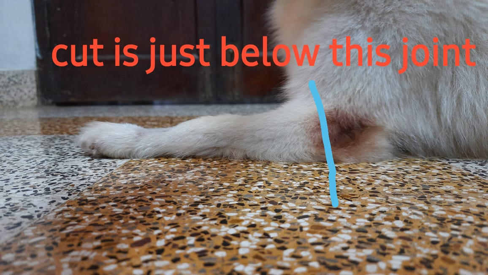
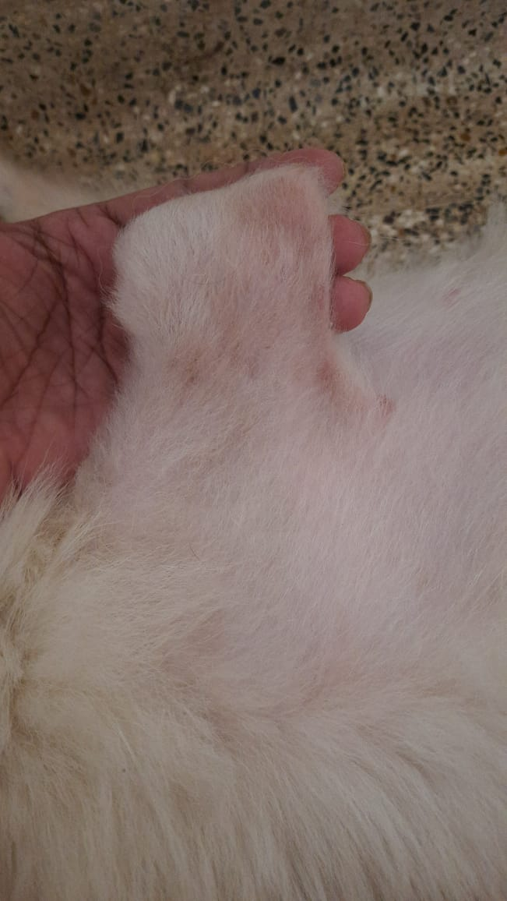

#Mothy needs a front leg
| Item     | Description                          |
| ----------- | --------------------------------- |
| Name :      |Mothy                              |  
|Requirement: |Lost her front left leg during an accident a year ago. She runs around easily with the existing 3 legs, even climb stairs. However, her parents are concerned that in the long run she might gain weight and when she gets old, it might be hard for her to move around |
|Species:     |Dog/Indian Spitz                   |
|Age :        |2 years                            |
|Weight:      |8.5 kgs                            |
|Height:      |                                   |
|Colour:      |Predominantly White colour coat    |
|Location     |India, Kerala, Kochi               |
<!-- Slider main container -->

<!-- Additional required wrapper -->

    <!-- Slides -->
    
   
        

        

    

        

 
    

    

        

    

    

        

 
    

    

        

 
    

